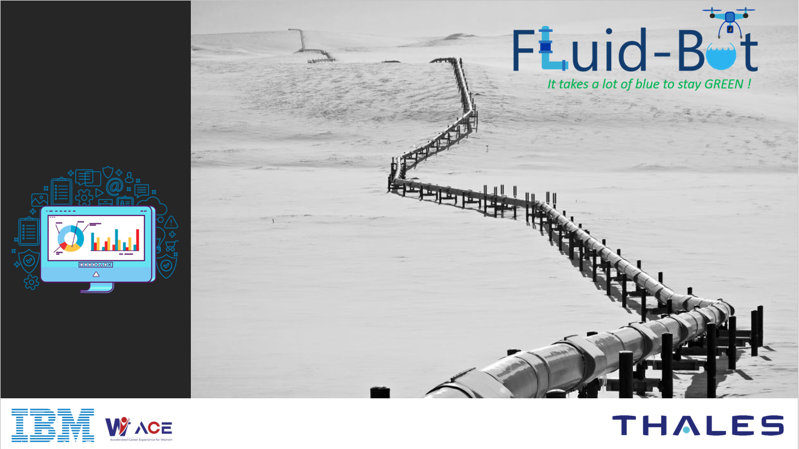
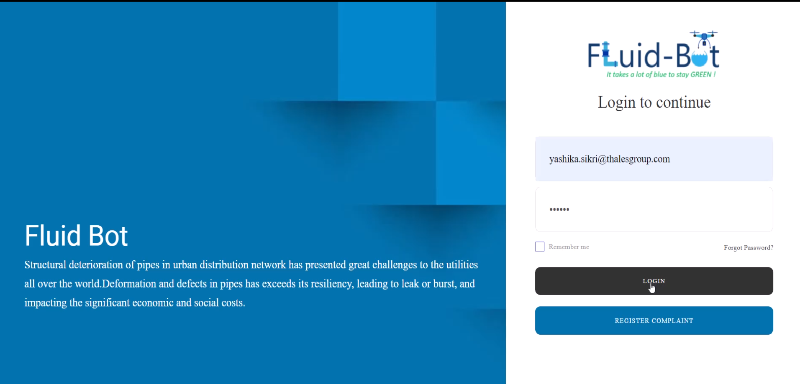
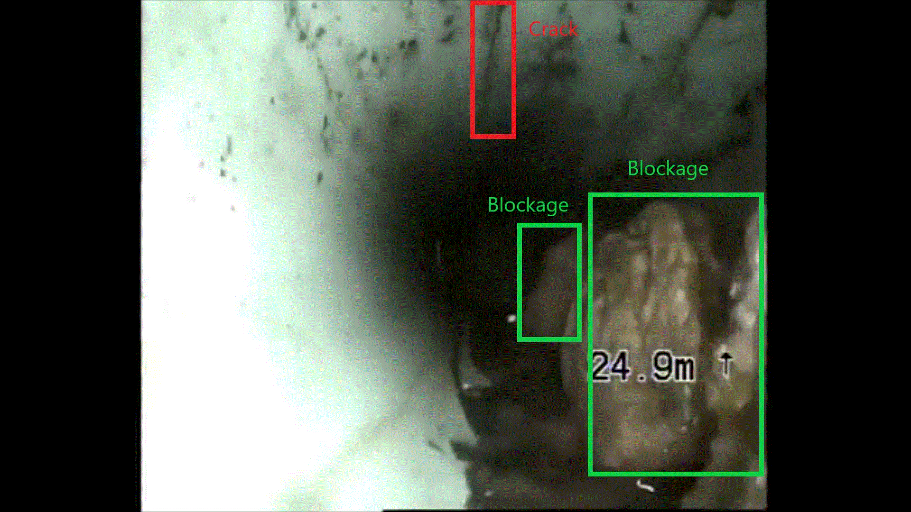
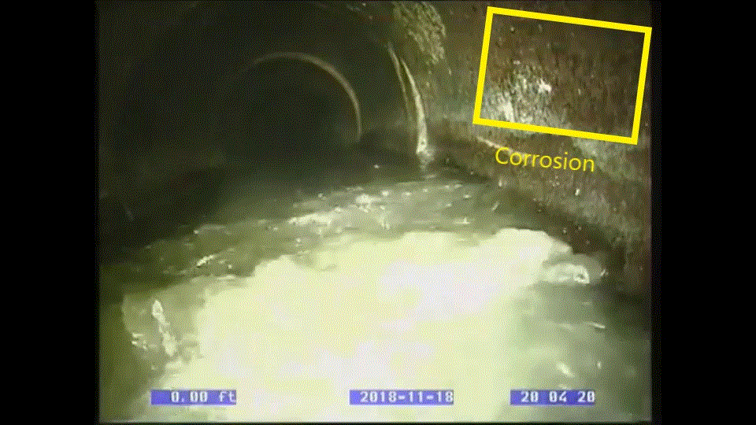
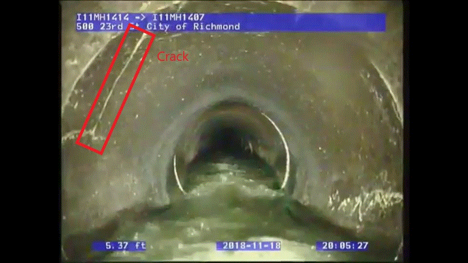

# FluidBot

## Contents
- [Short Description](#short-description)
  * [What's the problem?](#whats-the-problem)
  * [How can technology help?](#how-can-technology-help)
  * [The idea](#the-idea)
- [Demo Video](#demo-video)
- [Detailed Video](#detailed-video)
- [The Architecture](#the-architecture)
- [Long Description](#long-description)
  * [Section -1](#section--1)
  * [Section -2](#section--2)
  * [Section -3](#section--3)
- [Project RoadMap](#project-roadmap)
- [Getting Started](#getting-started)
- [Built with](#built-with)
- [Contributing](#contributing)
- [Versioning](#versioning)
- [Authors](#authors)

## Short Description
An Efficient AI based Solution to manage pipelined distribution system and take corrective measures.

### What's the problem?
In our day-to-day life, we come across pipeline accidents and their after-effects. Structural deterioration of pipes in urban distribution network has presented great challenges to the utilities all over the world. When the deterioration exceeds its resiliency, the pipes leak or burst, leading to significant socio-economic overhead. For example:

* Approximately 32 Billion cubic meters of treated water is lost through water distribution network all over the world. 
* The New York City has spent over $54.5 million to maintain its damaged pipelines in a span of 10 years. 
* Numerous severe accidents happen due to damaged pipelines that results in heavy causalities all over the world. 
* Leaks, emissions, and other types of damages destroy vegetation, harm wildlife, and increase water-and-air pollution levels.

Extremely high cost of checking even a single pipe makes the routine checkup of all pipes in the entire distribution network impractical.

All the problems listed above prompted us to look for innovative strategies that can significantly improve reliability of pipeline network servicing while minimizing repair and replacement costs.

### How can technology help?
Our solution can simplify the job of the concerned teams by efficient use of the pipeline distribution system with real-time monitoring and control. The solution can assist these teams to:
* Be proactive in pipeline infrastructure management.
* Identify and prioritize the pipes that need immediate attention.
* Predict remaining useful life span of the pipes.
* Minimize impacts by targeting the most critical and deteriorated pipes.
* Reduce overall probability of pipeline failures.

### The idea
These pipelines carry water, sewage, petroleum, and PNG. Any bursts in these pipelines can cause devastating damage to the nature. Therefore, the idea is to build a state-of-the-art solution that can help anticipate defects/bursts in the pipelines and predict their remaining useful life.

## Demo video

## Detailed video

## The Architecture
This diagram shows the high level architecture:

Following diagram shows the Crack and Blockage Identification process:

## Long Description
Pipeline distribution systems contain different types of buried pipes (for example, cast iron, ductile iron, asbestos cement, polyethylene, steel, and polyvinyl chloride). As pipeline infrastructure becomes older, its structural condition, hydraulic capacity, and performance deteriorates.

*Fluid-Bot* is a preventive and predictive AI-based solution that can continuously monitor the health of a complex pipeline infrastructure. It is a complete solution where pipelines will be scrutinized for blockage, leakage, corrosion, and defects. Flow sensors will be mounted on the hardware to measure the fluid flow rate. Local administrators can analyze complete pipeline conditions and take necessary corrective measures. End users can see the pipeline condition of their regions and file a complaint in case of any damage.    

Solution can be described in 3 Sections:

### Section -1
AI Based Data Modelling

IOT hardware with drone/camera feed will be an input to the model for detecting the pipe flow rate, diameter, area, blockage, corrosion, and breakage using TensorFlow neural networks. Flow sensors (hardware) mounted on the drone/camera will determine the fluid flow rate. These statistics will be used for estimating the remaining useful life of the pipe based on additional factors such as soil components, safety measures, geographical location, and fluid type. Moreover, recommendations about the type of pipes to be used in a specific region can be made.
### Section -2
Data Filtration

The processed data obtained from Section 1 is stored in a central server, database, or repository. When an end user requests to view the statistics using the UI, raw data for the requested location is fetched from the central server and cumulative data is prepared using Global APIs. This data provides information about the flow rate, prediction of pipe deterioration, and remaining useful life of the pipeline with recommendations. 
### Section -3
User Interface

Authorized users/administrators can view the data on FluidBot website. On successful log on to a specified zone, a Google API will request for the location and display the user's location data. Data of other regions can also be seen by selecting the location on the Google map. Based on the selected region, the data will be fetched from the central server with a live feed. Statistics of different regions can be compared. For alarming situations in any region, SMS/email messages can be sent to the designated person. The end users will have the read-only access to the UI and can file a complaint in case of any damage in their respective regions. 

## Project RoadMap

The RoadMap defines the timelines and Upcoming Features:

Features in Model 

    1.Fine Tuning the response time 
    2.Model Implementation for Pipe Material
    3.Recommendation for Alternate channel in case of Pipe Blockage 
    4.Water Quality Check
    
	
Features in UI 

    1.Android App in Google Play Store, Support for IOS Application 
    2.Adding QR Code 
    3.Recommendations for Pipe Material and Alternate channel 
    4.Water Quality for Specific Area

## Getting Started

The instructions can help you to install the project on you local environment

### Prerequisite 

Software's required 
1. Windows/Linux Server
2. Python 3.8 or above 
3. For windows install windows server 2019  
4. Please note if Linux is used then make sure linux is installed with desktop 
5. For Linux server enable the X11 Forwarding and gnome 

### Clone the repository

git clone https://github.com/ilika-rajbhandari/Fluid-Bot.git

### Run the project

Steps 
1. cd Fluid-Bot
2. pip install –r requirements.txt
3. Run command `python Main.py`
4. Enter the Video Path 
5. Output - Video Images and Excel File will be generated 

Running `Main.py` will ask for video path and process the frames to detect cracks,corrosion,blockage and flow rate.
 
#### Blockage Detection

#### Corrosion Detection

#### Crack Detection

## Built with
* [IBM Cloudant](https://cloud.ibm.com/catalog?search=cloudant#search_results) - Cloud Server
* [IBM Cloud Foundry](https://www.cloudfoundry.org/the-foundry/ibm-cloud-foundry/) - DashBoard Creation
* [IBM Angular API](https://www.ibm.com/cloud/blog/simple-angular-node-application) - The web framework used
* [IBM Watson Studio](https://cloud.ibm.com/catalog/services/watson-studio) - Data Preparation
* [Machine Learning](https://cloud.ibm.com/catalog/services/machine-learning) - RUL Prediction

## Contributing
See the list of [contributors](https://github.com/ilika-rajbhandari/Fluid-Bot/graphs/contributors) who participated in this project.

## Versioning
GitHub is used for versioning.

## Authors

